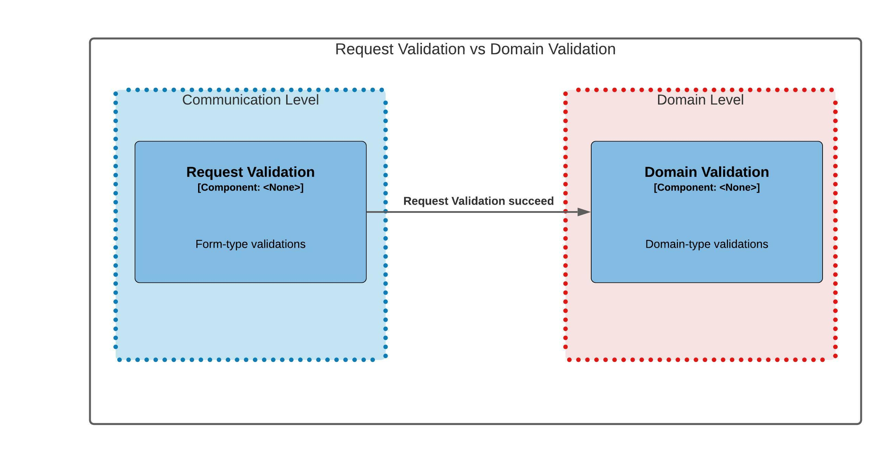

# Receivers aplicam validação de formulário 

## Status

**Proposed** -> 2022/02/08
### Responsables
* Rafael A. Silva (rafael.amaral@eximia.co)
* Thiago Candido  (thiago.candido@eximia.co)
* William Buzatto (william.buzatto@eximia.co)
* Leandro Almeida (leandro.almeida@cip-bancos.org.br)
* Oscar Azevedo   (oscar.azevedo@cip-bancos.org.br)

## Context

Funcionalidades gerais:
 * Disponibilizar portas de integração.
 * Efetuar todos os tratamentos relacionados a comunicação (Descompactação, Descriptografia, Validação Assinatura, <i>Schema Checking</i>).
 * Viabilizar escalabilidade para balancear o <i>throughput</i>, seguindo regras de <i>throttling</i> definidas pelo o time de negócio associado ao produto que o Receiver esta atendendo.
 * Aguardar que todas <i>Multipart Messages</i>[[1]](#1) cheguem antes de seguir o fluxo.
 * Armazenar Messages[[2]](#2) em tamanhos variáveis.

Problema:  
Distribuir regras de negócio associadas em multiplos serviços é contra indicado.[[3]](#3)

## Decision

Devemos separar <i>Request Validations</i> de <i>Domain Validations</i>, eis as definições:
* <i>Request validation: "Think of request validation as "have I filled out the form correctly". These are easily translatable to client-side validation rules. If it were 100 years ago, this would be a desk clerk just making sure you've filled in all the boxes appropriately. This sort of validation you can immediately return to the client and does not require any sort of domain-specific knowledge.". These are easily translatable to client-side validation rules."[[4]](#4)</i>
* <i>Domain validation: "A next-level validation is domain validation, or as I've often seen referred, "business rule validation". This is more of a system state validation, "can I affect the change to my system based on the current state of my system". I might be checking the state of a single entity, a group of entities, an entire collection of entities, or the entire system. The key here is I'm not checking the request against itself, but against the system state." [[5]](#5)</i>

  

  

Ficou decidido que o Receiver deve sustentar <i>Requests Validatations</i> em pró do conceito <i>Fail-Fast</i>, porém não deverá sustentar nenhum tipo de <i>Domain Validations</i> em busca de reduzir aos impactos ao principle do DRY. 

## Consequences

**Pros**
 * Reduz consumo de recurso em mensagens em estado de falha.

**Cons**
 * A compreensão de quando e como depende da compreensão do Desenvolvedor do conceito.
 * Pode gerar duplicações e assim quebrando o princípio DRY.

**Related Quality Attributes**
 * <i>Maintainability</i>

## Status log
2022/02/08 - Proposed by Eximia.

## Notes
<a id="1">[1]</a> Multipart Messages são mensagens que foram quebradas ou páginadas.  
<a id="2">[2]</a> Messages neste contexto está associado a qualquer channel (API, Message Broker ou File System).  
<a id="3">[3]</a> <a href="https://pt.wikipedia.org/wiki/Don%27t_repeat_yourself"> DRY (Don’t Repeat Yourself) principle</a>: EVERY PIECE OF KNOWLEDGE MUST HAVE A SINGLE, UNAMBIGUOUS, AUTHORITATIVE REPRESENTATION WITHIN A SYSTEM.  
<a id="4">[4]</a> Leia mais em: <a href="https://jimmybogard.com/domain-command-patterns-validation/">Request Validation - J Bogard</a>  
<a id="5">[5]</a> Leia mais em: <a href="https://jimmybogard.com/domain-command-patterns-validation/">Domain Validation - J Bogard</a>  